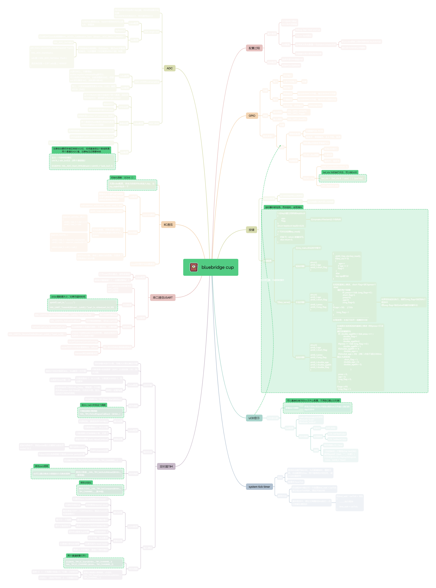

# bluebridge cup
codes for lanqiao competition (embedded application)

 include `LCD\GPIO\USART\TIM\IIC\Key\ADC` peripherals 

key-press logic effectively avoid joggling (click, double click, long press)

basically cover the outline of lanqiao cup, and finally I won the first prize. I believe being familiar with competition subject is important, so start practicing!

The mind map below is my study notes, for reference only.

